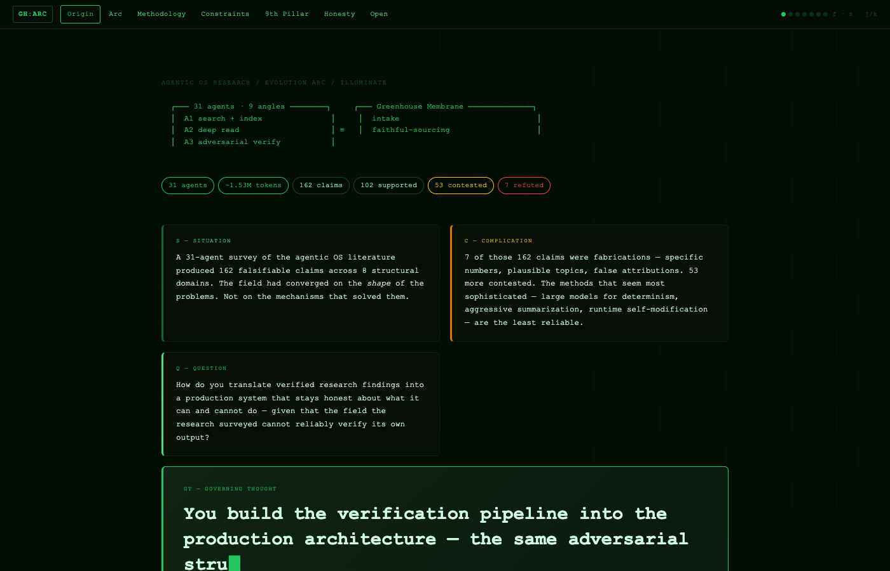
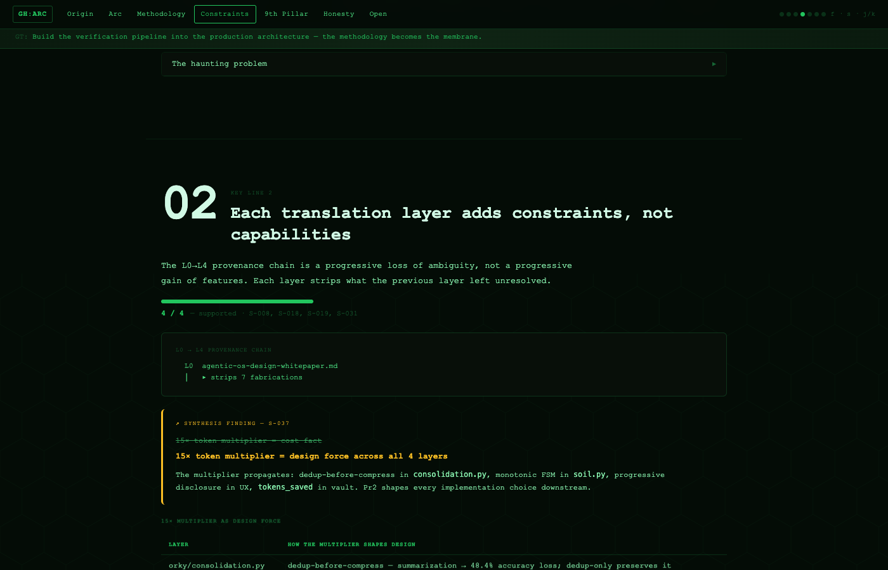
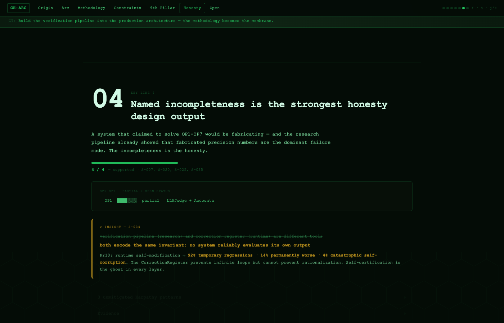

# illuminate

**Dense source in. Self-contained interactive HTML out.**

`/illuminate` transforms any complex source — research corpus, book, codebase, multi-file dump, conversation archive — into a single interactive HTML artifact that makes the argument's logical structure navigable, alive, and permanently legible.

---

## What you get

A single `.html` file. Zero dependencies. Opens in any browser, forever.

```
┌─────────────────────────────────────────────────────────────────────┐
│  STAGE I — INPUT                                                     │
│  Multi-source ingestion · signal stratification · provenance audit  │
├─────────────────────────────────────────────────────────────────────┤
│  STAGE II — PROCESS                                                  │
│  Concept mapping · Barbara Minto Pyramid · MECE issue tree          │
│  3-skeptic adversarial audit                                        │
├─────────────────────────────────────────────────────────────────────┤
│  STAGE III — OUTPUT                                                  │
│  Parallax · 3D card physics · animated ASCII art · evidence drawer  │
│  Confidence meters · keyboard navigation · progressive disclosure   │
└─────────────────────────────────────────────────────────────────────┘
```

**Evidence discipline contract (non-negotiable):**
- `ASSERT` only claims tracing to a specific `S-NNN` signal block entry
- `HEDGE` contested or version-fragile claims
- `EXCLUDE` anything unverifiable — named, not silently dropped

---

## Install

```bash
# Option 1: clone and symlink
git clone https://github.com/marcomorettim/illuminate
ln -s $(pwd)/illuminate ~/.claude/skills/illuminate

# Option 2: Claude Code skill install (when registry is available)
claude skills install gh:marcomorettim/illuminate
```

---

## Usage

```
/illuminate <source>
```

Works on:
- Single documents (`.md`, `.pdf`, `.txt`)
- Multi-file directories (`/illuminate src/`)
- Research corpora with provenance chains (`/illuminate corpus/ --arc`)
- Pasted content (start a conversation, then `/illuminate`)

---

## Output anatomy

| Component | What it does |
|---|---|
| Boot overlay | Terminal-style startup sequence |
| SCQA hero | Situation / Complication / Question / Answer cards |
| Governing Thought | Full-width typewriter animation, sticky strip on scroll |
| Stats strip | 6 key numbers computed from the signal block |
| Key Lines (KL1–KLn) | MECE structure, each with confidence meter + evidence chips |
| Insight callouts | Counter-intuitive findings with before/after strikethrough |
| Evidence drawer | Click any `S-NNN` chip → full signal block entry slides in |
| ASCII art engine | Character-by-character renderer, `prefers-reduced-motion` aware |
| 3D card physics | `perspective + rotateX/Y` on mousemove delta |
| Keyboard nav | `j/k` scroll sections · `f` focus mode · `s` signal mode · `Escape` close drawer |

---

## Screenshots

**Hero — SCQA + boot sequence**


**Key Line section — confidence bar + insight callout**


**Open Problems — CSS progress bars + OP3 amber pulse**


---

## Examples

Three real artifacts produced by `/illuminate`:

| Artifact | Source | Size |
|---|---|---|
| [agentic-os-evolution.html](examples/agentic-os-evolution.html) | 34,600-word whitepaper + 6-document evolution arc | 83KB |
| [agentic-os-whitepaper.html](examples/agentic-os-whitepaper.html) | Same whitepaper, single-document run | 60KB |
| [greenhouse-memory.html](examples/greenhouse-memory.html) | Greenhouse memory architecture corpus | 70KB |

Open any of these locally — no server required.

---

## Stage detail

### Stage I — Signal extraction

Three mandatory angles:
1. **Structural** — every named claim, fact, figure, argument, principle
2. **Synthesis + insight** — what the combination implies; counter-intuitive reversals
3. **Adversarial** — gaps, assumptions, falsifiable edges

Six signal tags: `SOURCE · INSIGHT · METRIC · PRINCIPLE · SYNTHESIS · GAP`

Secondary flags: `CONTESTED:unverified · CONTESTED:absolute · ASSUMPTION · REFUTED`

### Stage II — Minto Pyramid

- Hub detection: rank concepts by connection count
- Issue tree: decompose "Why is [GT] true?" into sub-questions → KL candidates
- MECE type: `process / structure / situation` (must not mix)
- 3-skeptic adversarial audit: Structuralist, Bayesian, Pragmatist — each tries to collapse the pyramid

All four SCQA quality tests run before the anchor writes to disk:
- **S**: would the reader nod without thinking?
- **C**: does it follow FROM S, not alongside it?
- **Q**: does it emerge inevitably from S+C?
- **A**: does it directly resolve the S+C tension?

### Stage III — HTML artifact

- Vanilla HTML + CSS + JS — zero external dependencies
- Single file, self-contained, permanently legible
- All animation respects `prefers-reduced-motion`
- Parallax: 4 layers (hex canvas, amber fragments, scan lines, content)
- Evidence drawer: slides in from right, `Escape` closes

---

## The haunting problem

Every enforcement mechanism — confidence grades, phase gates, adversarial audits — is executed by the same model they constrain. The model grades itself. The correction register (max 3 attempts, then escalate) prevents infinite loops but cannot prevent rationalization. `/illuminate` makes this visible: confidence scores are shown with their evidence traces; `HEDGE` and `EXCLUDE` tags are surfaced, not hidden; KL3 that scored 3/4 shows the unconditional claim it cannot make.

The incompleteness is the honesty.

---

## License

MIT
